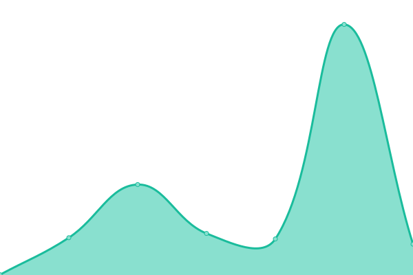
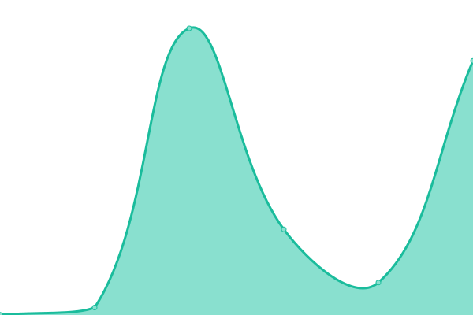

# [📈 Live Status](https://demo.upptime.js.org): <!--live status--> **🟩 All systems operational**

This repository contains the open-source uptime monitor and status page for [Trade-EC](https://demo.upptime.js.org), powered by [Upptime](https://github.com/upptime/upptime).

With [Upptime](https://upptime.js.org), you can get your own unlimited and free uptime monitor and status page, powered entirely by a GitHub repository. We use [Issues](https://github.com/Trade-EC/ORDERS_SERVICE_UPTIME/issues) as incident reports, [Actions](https://github.com/Trade-EC/ORDERS_SERVICE_UPTIME/actions) as uptime monitors, and [Pages](https://demo.upptime.js.org) for the status page.

<!--start: status pages-->
<!-- This summary is generated by Upptime (https://github.com/upptime/upptime) -->
<!-- Do not edit this manually, your changes will be overwritten -->
<!-- prettier-ignore -->
| URL | Status | History | Response Time | Uptime |
| --- | ------ | ------- | ------------- | ------ |
|  [Health Readiness](https://e7dsd3oc87.execute-api.us-east-2.amazonaws.com/dev/api/v4/private/orders/readiness) | 🟩 Up | [health-readiness.yml](https://github.com/rafaelvacatrd/ORDERS_SERVICE_UPTIME/commits/HEAD/history/health-readiness.yml) | 

 209ms
     
 | 

<a href="https://demo.upptime.js.org/history/health-readiness">100.00%</a>
    

|  [Health Liveness](https://e7dsd3oc87.execute-api.us-east-2.amazonaws.com/dev/api/v4/private/orders/liveness) | 🟩 Up | [health-liveness.yml](https://github.com/rafaelvacatrd/ORDERS_SERVICE_UPTIME/commits/HEAD/history/health-liveness.yml) | 

 747ms
     
 | 

<a href="https://demo.upptime.js.org/history/health-liveness">100.00%</a>
    

<!--end: status pages-->

[**Visit our status website →**](https://demo.upptime.js.org)

## 📄 License

- Powered by: [Upptime](https://github.com/upptime/upptime)
- Code: [MIT](./LICENSE) © [Anand Chowdhary](https://anandchowdhary.com), supported by [Pabio](https://pabio.com)
- Data in the `./history` directory: [Open Database License](https://opendatacommons.org/licenses/odbl/1-0/)
